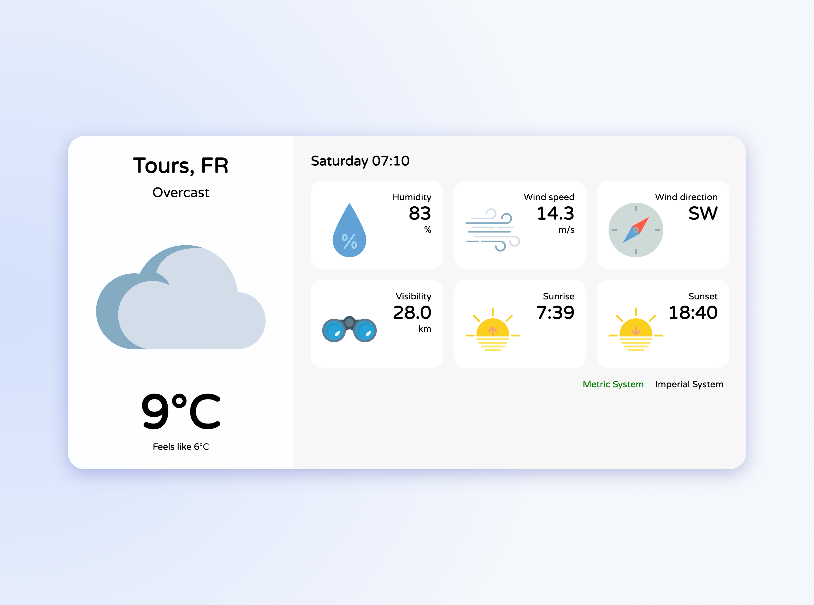

# Weather App

This project displays the current weather for a pre-configured city. Data is fetched from the **Open Meteo API**.

This project is an adaptation of an existing weather app ([original repo](https://github.com/madzadev/weather-app)) and was developed as part of my application process for the **Concepteur·trice Développeur·se d’Application – spécialité Éco-conception** training at **Simplon**.



## Changes Made Compared to the Original App

1. Replaced the **OpenWeatherMap API** with **Open Meteo API**.
2. Removed the city search functionality. The city is now **pre-configured** via `config/city.json`.
3. Added **automatic hourly refresh** of weather data.
4. Updated the data mapping to handle **Open Meteo weather codes**.
5. Weather icons and descriptions now adapt to **day/night** based on sunrise and sunset times.

## Features

1. Pre-configured city weather

2. Current local time and date

3. Temperatures and humidity

4. Wind speed and direction

5. Sunrise and sunset times

6. Data refresh every hour

7. Weather condition description

8. Weather icons adapted for day/night

9. Metric vs Imperial system

10. Error handling and loading info


## Prerequisites
> ### Use Node.js v16

Verify Node.js Version

```bash
node -v
```

If your version is not v16.x.x:
```bash
nvm install 16
nvm use 16
```

## Installation

1. `git clone https://github.com/MariamNze/weather-app-simplon.git`

2. `cd weather-app-simplon`

3. `npm install`

4. `npm run dev`

5. Open your browser at http://localhost:3000
The city for which weather is displayed can be configured in `config/city.json`